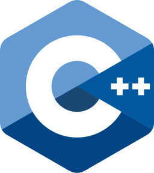
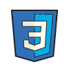
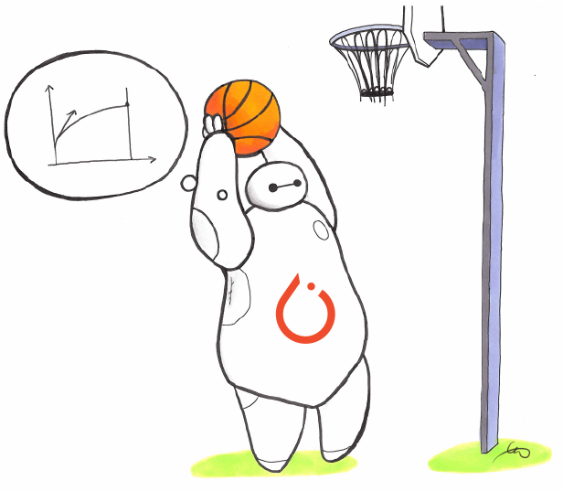
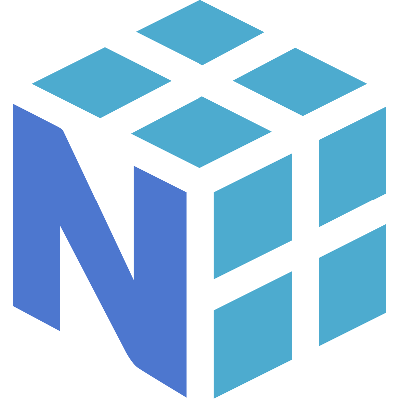

## Hi there 👋 I'm Saad Shah!

## 📂 Portfolio
### **Welcome to my professional portfolio, where I showcase my latest web applications, open‑source contributions, and data‑driven projects.**
### **🌐 Explore my work ➔ **

---

## Tech Arsenal

<table align="left">
  <tr>
    <td align="left">
      <h2> Languages</h2>
      

        &nbsp;&nbsp;
        &nbsp;&nbsp;
        &nbsp;&nbsp;
      

    </td>
    <td align="left">
      <h3> Frontend</h3>
      

        &nbsp;&nbsp;
        &nbsp;&nbsp;
        &nbsp;&nbsp;
      

    </td>
  </tr>
  <tr>
    <td align="left">
   <h3> Backend</h3>
      

         &nbsp;&nbsp;
<!--         &nbsp;&nbsp;  -->
     

    </td>
    <td align="left">
      <h3> ML/AI</h3>
      

        &nbsp;&nbsp;
        &nbsp;&nbsp;
        &nbsp;&nbsp;
        &nbsp;&nbsp;
      

    </td>
  </tr>
  <tr>
    <td align="left">
      <h3> Data Science</h3>
      

        &nbsp;&nbsp;
        &nbsp;&nbsp;
        &nbsp;&nbsp;
        &nbsp;&nbsp;
        &nbsp;&nbsp;
      

    </td>
    <td align="left">
      <h3> Databases</h3>
      

        &nbsp;&nbsp
      

    </td>
  </tr>
  <tr>
    <td align="left" colspan="2">
      <h3> DevOps & Tools</h3>
      

        &nbsp;&nbsp;
        &nbsp;&nbsp;
        &nbsp;&nbsp;
        &nbsp;&nbsp;
      

    </td>
  </tr>
</table>

## 🔗 Connect with me:

## 👀 Visitor Count:

👋

<!--
**baihelahusain/baihelahusain** is a ✨ _special_ ✨ repository because its `README.md` (this file) appears on your GitHub profile.

Here are some ideas to get you started:

- 🔭 I’m currently working on ...
- 🌱 I’m currently learning ...
- 👯 I’m looking to collaborate on ...
- 🤔 I’m looking for help with ...
- 💬 Ask me about ...
- 📫 How to reach me: ...
- 😄 Pronouns: ...
- ⚡ Fun fact: ...

